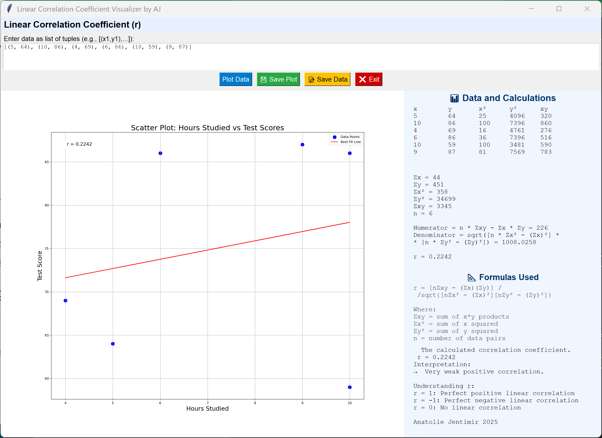

# 📈 Linear Correlation Coefficient Visualizer App




**Download ** [Linear Correlation Coefficient Visualizer v2.0.exe](https://github.com/jentimanatol/LinearCorrelationCoefficientVisualizerApp/releases/tag/v2.0)  
**Author:** [@jentimanatol](https://github.com/jentimanatol)  
**Download:** 👉 [Get Latest Release](https://github.com/jentimanatol/LinearCorrelationCoefficientVisualizerApp/releases)

---

## 🧠 What is it?

**Linear Correlation Coefficient Visualizer** is an interactive **Tkinter-based Python application** that lets you:
- Input paired numerical data (e.g., hours studied vs test scores)
- Instantly **visualize scatter plots**, **regression lines**, and **compute the Pearson correlation coefficient (r)**
- Understand the strength & direction of the relationship
- Save results and plots with just a click!

Perfect for:
- **Students** learning about statistics
- **Educators** explaining correlation concepts
- **Data analysts** exploring linear relationships

---

## 🛠️ Features

✅ Clean GUI with modern controls  
✅ Real-time plotting with `matplotlib`  
✅ Interprets strength of correlation (e.g., weak, strong, negative, none)  
✅ Shows all intermediate calculations (Σx, Σy, Σxy, etc.)  
✅ Easy saving of data and plots  
✅ Supports custom data input  
✅ Open-source and offline-ready

---

### 💡 How to Use

1. Launch the app
2. Enter data like:
   ```
   [(5, 64), (10, 86), (4, 69), (6, 86), (10, 59), (9, 87)]
   ```
3. Click **Plot Data**
4. View the **scatter plot**, **line of best fit**, and **correlation coefficient**
5. Use 💾 buttons to save your work
6. Exit anytime with ❌

---

## 📊 What You’ll See

- ✏️ **Scatter plot** with trendline  
- 🧮 **Calculated values**:
  - Sum of x, y, x², y², xy
  - Pearson `r` formula results
- 💬 **Natural language interpretation** like:
  - `"Strong positive correlation"`
  - `"No correlation"`

---

## 📸 Screenshot


---

## 🧩 App Icon


---

## 📦 Releases

🔖 Grab the latest release here:  
👉 [v1.2 - Download EXE or ZIP](https://github.com/jentimanatol/LinearCorrelationCoefficientVisualizerApp/releases/tag/v1.2)

---

## 🤝 Contributing

Pull requests are welcome! If you find a bug or want a feature, open an [issue](https://github.com/jentimanatol/LinearCorrelationCoefficientVisualizerApp/issues).

---

## 🌟 Star the Repo!

If you like this app, give it a ⭐ on [GitHub](https://github.com/jentimanatol/LinearCorrelationCoefficientVisualizerApp)!

---

## 📚 Learn More

- [Pearson Correlation Coefficient (Wikipedia)](https://en.wikipedia.org/wiki/Pearson_correlation_coefficient)
- [Understanding Correlation - Verywell Mind](https://www.verywellmind.com/what-is-a-correlation-2795786)

---

## 📬 Contact

Created with ❤️ by [Anatolie Jentimir](https://github.com/jentimanatol)  
Open to feedback and improvements!
